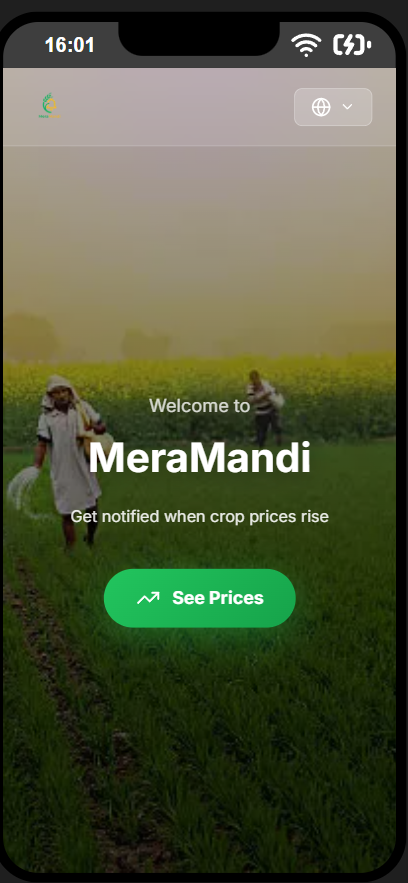
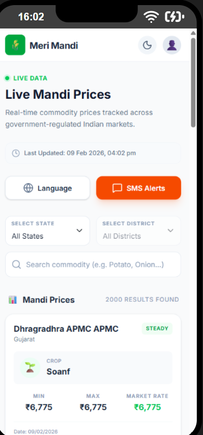
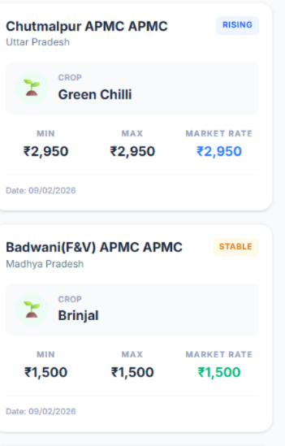

# 🌾 Meri Mandi - Voice Agent for Commodity Prices

A Next.js powered voice agent platform that helps farmers get real-time commodity prices through automated phone calls. Farmers simply call a Twilio number, speak their location, and receive price information via SMS.

**Status**: ✅ Production Ready

---

## 🎯 Features

- **Voice Agent**: Automated phone calls using Twilio
- **Speech Recognition**: Understand farmer inputs via voice
- **Real-time Pricing**: Fetch live government commodity prices
- **SMS Notifications**: Send price alerts via SMS
- **Multi-language Support**: Support for multiple Indian languages
- **Email Alerts**: Optional email notifications
- **User Authentication**: Secure login and registration
- **Location Tracking**: State and district-based price queries

---

## 🏗️ Architecture

```
┌─────────────────┐
│   Farmer        │
│  (Phone Call)   │
└────────┬────────┘
         │
         ▼
┌─────────────────────────┐
│   Twilio Voice API      │
│  (Voice Recognition)    │
└────────┬────────────────┘
         │
         ▼
┌─────────────────────────┐
│   Next.js Backend       │
│  (Voice Processing)     │
└────────┬────────────────┘
         │
         ├──────────────────┐
         │                  │
         ▼                  ▼
┌──────────────────┐  ┌──────────────────┐
│ Government API   │  │  MongoDB         │
│ (Prices)         │  │ (User Data)      │
└──────────────────┘  └──────────────────┘
         │
         ▼
┌─────────────────────────┐
│  Twilio SMS API         │
│  (Send Prices to Phone) │
└─────────────────────────┘
```

---

## 🚀 Quick Start

### Prerequisites
- Node.js 18+ installed
- MongoDB Atlas account (free tier available)
- Twilio account with SMS and Voice capabilities

### Installation

1. **Clone and Install**
```bash
npm install
```

2. **Setup Environment Variables** (`.env.local`)
```
MONGODB_URI=your_mongodb_connection_string
TWILIO_ACCOUNT_SID=your_account_sid
TWILIO_AUTH_TOKEN=your_auth_token
TWILIO_PHONE_NUMBER=your_twilio_phone
GOV_API_KEY=your_government_api_key
USE_MOCK_DATA=false
```

3. **Run Development Server**
```bash
npm run dev
```

4. **Visit the App**
Open [http://localhost:3000](http://localhost:3000)

---

## 📁 Project Structure

```
src/
├── app/
│   ├── api/              # API routes (auth, prices, Twilio webhooks)
│   ├── home/             # Home page
│   ├── prices/           # Price lookup page
│   ├── profile/          # User profile page
│   └── page.tsx          # Landing page
├── components/           # Reusable React components
├── models/               # MongoDB schemas (User, Alert, CallSession)
├── services/             # Business logic (emailer, govApi, notifier)
├── constants/            # Language and location data
├── lib/                  # Utilities (MongoDB connection)
└── styles/               # Global styles

public/                   # Static assets
```

---

## 🛠️ Tech Stack

- **Frontend**: React 19, Next.js 16, Tailwind CSS
- **Backend**: Next.js API Routes
- **Database**: MongoDB with Mongoose ODM
- **Voice/SMS**: Twilio API
- **Authentication**: JWT with bcryptjs
- **Translation**: Google Cloud Translate
- **Email**: Nodemailer

---

## 📋 Environment Variables

| Variable | Description | Required |
|----------|-------------|----------|
| `MONGODB_URI` | MongoDB connection string | ✅ |
| `TWILIO_ACCOUNT_SID` | Twilio account ID | ✅ |
| `TWILIO_AUTH_TOKEN` | Twilio authentication token | ✅ |
| `TWILIO_PHONE_NUMBER` | Your Twilio phone number | ✅ |
| `GOV_API_KEY` | Government API key for commodity prices | ✅ |
| `USE_MOCK_DATA` | Use mock data instead of real API | ⚠️ |

---

## 🔄 How It Works

**1. Farmer Calls**
- Farmer dials your Twilio number

**2. Voice Flow**
- Bot asks: "What's your name?"
- Bot asks: "Which state are you from?"
- Bot asks: "Which district?"
- Bot asks: "What crop are you interested in?"

**3. Data Processing**
- Voice is converted to text
- System fetches commodity prices from government API
- User preferences are saved to MongoDB

**4. SMS Alert**
- Farmer receives SMS with current prices
- Price alerts are created in the database

---

## 📸 Screenshots & Diagrams

### Dashboard


![Dashboard Screenshot]

### Price Lookup Page
[ADD SCREENSHOT HERE - Real-time price listings]

![Price Lookup Screenshot]


## 👥 Team Contributions

We welcome contributions from the community! Here's how you can help:

### Areas for Contribution
<!DOCTYPE html>
<html lang="en">
<head>
    <meta charset="UTF-8">
    <title>Team</title>
    <meta name="viewport" content="width=device-width, initial-scale=1.0">
    <style>
        body {
            font-family: Arial, sans-serif;
            background: linear-gradient(to right, #0f2027, #203a43, #2c5364);
            margin: 0;
            padding: 0;
            color: white;
            text-align: center;
        }

        .container {
            padding: 50px 20px;
        }

        h1 {
            font-size: 40px;
            margin-bottom: 40px;
        }

        .team-card {
            background: rgba(255, 255, 255, 0.1);
            padding: 20px;
            margin: 20px auto;
            width: 300px;
            border-radius: 12px;
            transition: 0.3s;
        }

        .team-card:hover {
            transform: scale(1.05);
            background: rgba(255, 255, 255, 0.2);
        }

        .team-name {
            font-size: 20px;
            margin-bottom: 10px;
        }

        .linkedin-btn {
            text-decoration: none;
            background: #0077b5;
            color: white;
            padding: 8px 15px;
            border-radius: 5px;
            display: inline-block;
            transition: 0.3s;
        }

        .linkedin-btn:hover {
            background: #005582;
        }

        @media (max-width: 500px) {
            .team-card {
                width: 90%;
            }
        }
    </style>
</head>
<body>

    <div class="container">
        <h1>Team</h1>

        <div class="team-card">
            <div class="team-name">Saksham Arora</div>
            <a href="https://www.linkedin.com/in/saksham-arora-bb4831329/" target="_blank" class="linkedin-btn">LinkedIn</a>
        </div>

        <div class="team-card">
            <div class="team-name">Anubhav Dash</div>
            <a href="https://www.linkedin.com/in/anubhav-dash-b1a132217/" target="_blank" class="linkedin-btn">LinkedIn</a>
        </div>

        <div class="team-card">
            <div class="team-name">Yashasvi Rastogi</div>
            <a href="https://www.linkedin.com/in/yashasvi-rastogi-32b8b4362/" target="_blank" class="linkedin-btn">LinkedIn</a>
        </div>

        <div class="team-card">
            <div class="team-name">Tejaswani Nayak</div>
            <a href="https://www.linkedin.com/in/tejaswani-nayak-1a0a6a286/" target="_blank" class="linkedin-btn">LinkedIn</a>
        </div>

    </div>

</body>
</html>


### How to Contribute

1. Fork the repository
2. Create a feature branch (`git checkout -b feature/amazing-feature`)
3. Commit your changes (`git commit -m 'Add amazing feature'`)
4. Push to the branch (`git push origin feature/amazing-feature`)
5. Open a Pull Request

---

## 🐛 Troubleshooting

### Voice Not Being Recognized
- Check Twilio credentials are correct
- Verify phone number has voice capabilities enabled
- Ensure user is speaking clearly during call

### SMS Not Sending
- Verify `TWILIO_PHONE_NUMBER` is correct
- Check Twilio account has SMS balance
- Ensure phone number format is correct (with country code)

### Government API Errors
- Verify `GOV_API_KEY` is valid
- Check internet connection
- Try enabling `USE_MOCK_DATA=true` for testing

### MongoDB Connection Issues
- Verify `MONGODB_URI` connection string
- Check MongoDB Atlas IP whitelist includes your server
- Ensure credentials are correct

---

## 📚 Additional Resources

- [Twilio Documentation](https://www.twilio.com/docs)
- [Next.js Documentation](https://nextjs.org/docs)
- [MongoDB Documentation](https://docs.mongodb.com)
- [Government India Commodity API](https://data.gov.in)

---

## 📄 License

[ADD LICENSE HERE - MIT, Apache 2.0, etc.]

---

## 👨‍💼 Contact & Support

**Project Lead**: [ADD NAME AND EMAIL]

**Questions?** [ADD CONTACT METHOD]

**Found a bug?** [ADD ISSUE SUBMISSION LINK]

---

**Last Updated**: February 2026  
**Version**: 1.0.0
